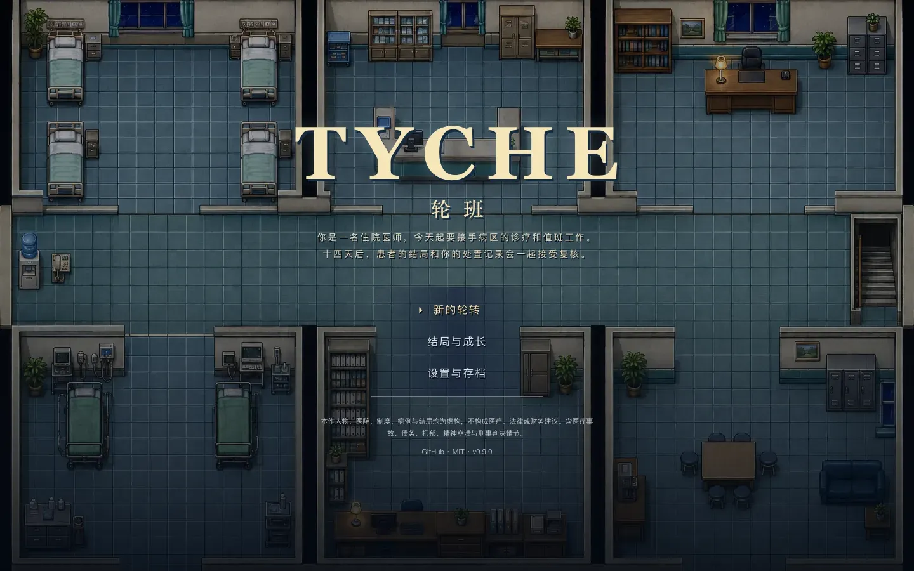
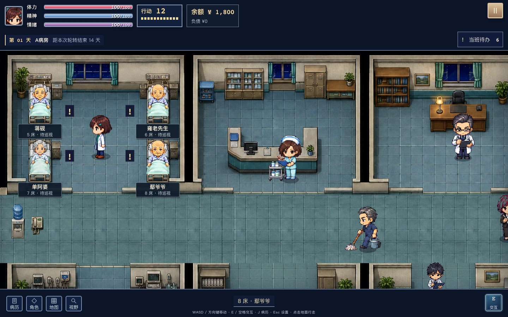
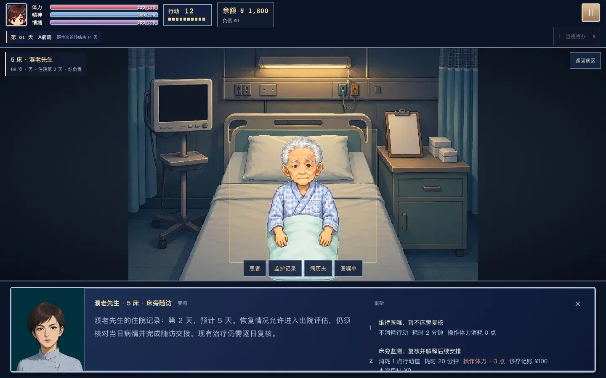
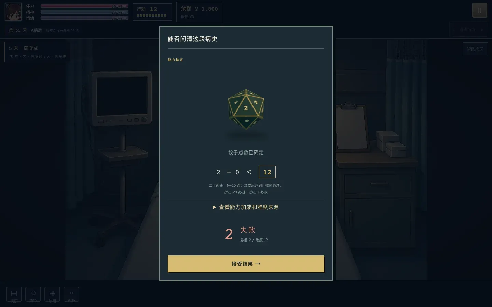
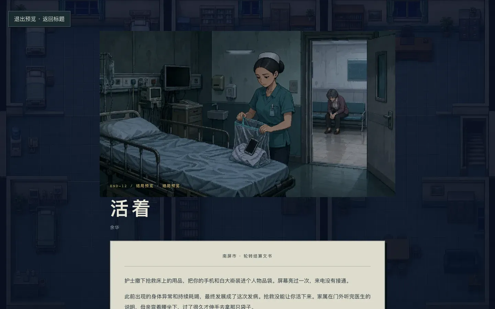
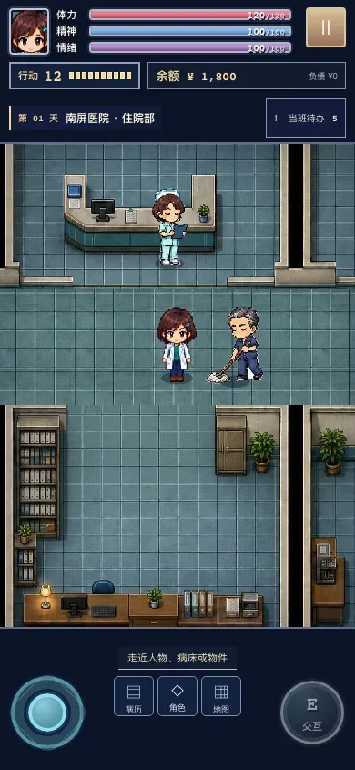

# Tyche · 轮班

[简体中文](README.md) · [日本語](README.ja.md)

A Chinese-language 2D pixel JRPG about a resident doctor's fourteen-day hospital rotation. Walk through the ward, read patient records, make treatment decisions and roll a twenty-sided die. When the rotation ends, the hospital reviews the records, recordings and bills left by those decisions.

[Play in your browser](https://mycyg.github.io/tyche/) · [Report an issue](https://github.com/mycyg/tyche/issues)

<table>
  <tr>
    <td align="center"><br />Title screen</td>
    <td align="center"><br />Ward map</td>
    <td align="center"><br />Bedside consultation</td>
  </tr>
  <tr>
    <td align="center"><br />Skill check roll</td>
    <td align="center"><br />Ending document</td>
    <td align="center"><br />Mobile layout</td>
  </tr>
</table>

Development version: 0.9.0. All 23,986 current voice cues are included. See the [ward and browser checks](docs/ward-visual-audit-2026-09-08.md) and [coverage criteria](docs/verification.md). The game itself is in Chinese.

The content catalog contains 20 branching clinical cases, 208 case presets, 251 patient identities, 212 events, 30 talents, 40 main endings (END-01–END-40) and existing attachment-type endings. Four intertwined storylines track favors, private loans, family recordings and research. Catalog totals do not certify that every route has passed testing.

Move with WASD, arrow keys, click-to-walk or the touch joystick. Use E or Space near a person or bed. J opens the records. Action points, stamina, SAN, emotions and personal debt persist through the rotation. Music, voices and sound effects have separate controls. Portrait and landscape layouts, larger text and reduced motion are supported.

## Run locally

Use Node.js 22.12 or newer.

```sh
npm ci
npm run dev
```

Open the `/tyche/` address printed by Vite. Engineering and release commands are listed in the [Chinese README](README.md#本地运行). Save data stays in the browser; export it before changing devices or clearing site data.

All characters, institutions, cases, medical rules, budgets, interest rates and judgments are fictional game content. The game includes medical harm, psychological distress, debt and criminal proceedings. It is not medical, legal or financial advice.

## Credits and license

The project grew out of conversations with a friend about playing [《今天你刑医了吗》](https://xingyi.yilutong.xyz/). Tyche's writing, case arrangements, characters, talents, code and artwork are independently created. No text or assets from that game are included, and no endorsement or affiliation is implied.

Original code and included original assets use the [MIT license](LICENSE). Third-party components retain their licenses; see [Third-party notices](THIRD_PARTY_NOTICES.md).

Author: [mycyg](https://github.com/mycyg)
