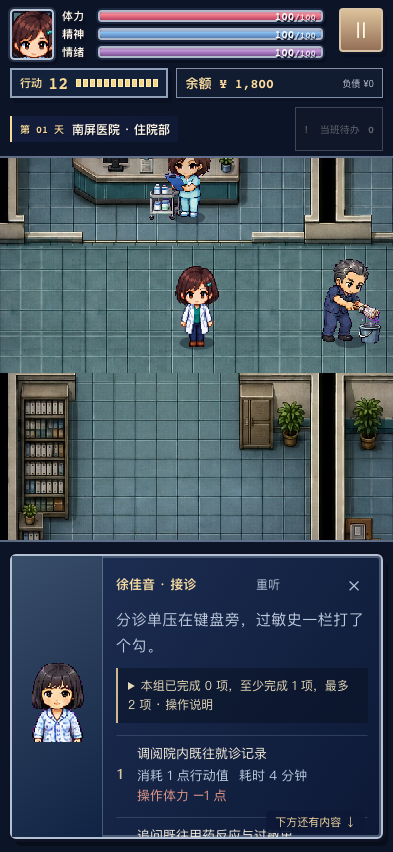
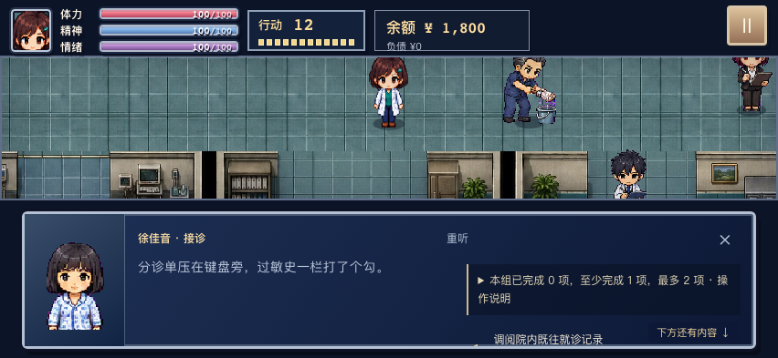

# 玩家体验与状态一致性

## 剧情与患者状态

| 情境 | 游戏行为 |
| --- | --- |
| 签字自行离院、劝留失败或放任提前离院 | 患者离开病床，床位释放，同一患者未执行的现场诊疗撤下。已经产生的风险、责任及后续联系继续保留。 |
| 口服用药，没有进入抢救 | 文书页说明本次未抢救，提供过敏记录，不要求补写抢救记录或报告尚未发生的药品不良反应。旧存档中尚未确认的错误抢救文书检定也不会收费或虚构经过。 |
| 冠脉介入或溶栓的治疗同意 | 完成知情沟通后才能启动对应治疗；首次劝说失败仍停在沟通阶段，不能自行推进术前流程。 |
| 补充风险沟通 | 已完成的告知与交接得到承认，未查明病因、未完成治疗以及既往损害仍保留。 |
| 单独问诊 | 请母亲回避后，后续问诊、查体与影像场景保持母亲在诊室外的状态。 |
| 伴侣与家庭 | 未设置伴侣时，不出现伴侣专属失业、付款和家庭链事件。伴侣来电使用伴侣自己的短语音。 |
| 系统故障与患者主诉 | 系统故障在护士站处理，不绑定死亡患者的床位。腰痛注射事件限定相符的主诉；酒商身份不向其他病例添加腹胀。 |

这些调整不消除既往诊疗风险，也不会替玩家完成未做的治疗。旧存档中已经完成的错误文书仍属于历史记录；不会把当时没有发生的抢救补写为事实。

## 操作与信息

- 收益受天赋调整时，同时显示原金额和实际到账额；额外行动消耗说明基础值与追加值。
- 夜间查看病历不按新急诊重复收取基础消耗。计划夜班内按分钟计时，没有夜班预算时不凭空制造超时罚损。
- 接诊前显示当前夜班时间、体力及后续处置提示。待办数量明确限定为当前阶段。
- 电话求助与已签收交班区分清楚：电话援助不会自动免除尚未交出的工作。
- 分组操作说明默认收起，需要时展开。完成一组后可直接继续；其他需要执行并计费的选择保留确认。
- 长对话显示下方内容提示，滚动到底后提示消失。手机横屏交谈时收起次要状态行，增加可见地图区域。
- 结局中的未来约定标明日期与未执行状态；标题分隔符不同的同一附件只出现一次。

## 角色声音

13 组角色，每组三句，共 39 句固定短回应。每次互动只播放一句，原句可重听；旁白不朗读。核心人物保持各自声线，普通患者与家属按角色组共用声音。录音由 RTX 3090 上的 Qwen3-TTS 生成，使用原创合成参考声线，39 句转写均与台词相符。

## 浏览器画面

手机竖屏保留完整患者画框、可展开的操作说明与向下提示：

手机横屏保留地图、状态条和可滚动的操作区：

画面来自复用正式组件的开发场景，不计作自然通关。Chromium 与 WebKit 均检查 393×852、852×393 和 1440×900；所有操作可以滚动到达，页面无横向溢出。另有六种视口的角色立绘边界检查，以及正常开局、声音播放、地图和存档继续的浏览器检查。浏览器模拟不等于实体手机验收，也不代表全部剧情分支覆盖。

## 验证结果

140 个测试文件、2,622 项单元与集成检查通过，包含 17 项玩家报告回归。类型、lint、内容、音频与生产构建检查通过；四种策略共 12 次整局模拟完成。浏览器端 16 项正式构建检查、18 项立绘、动作、语音与操作场景检查通过。39 句声音均经两个浏览器实际解码播放。
