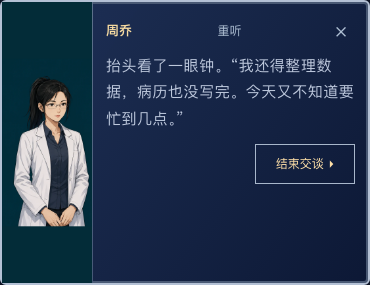
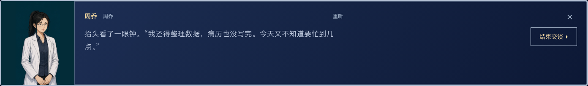
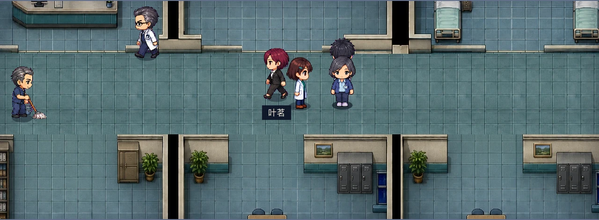

# 病区画面与人物行为验收

游玩地址：[Tyche · 轮班](https://mycyg.github.io/tyche/)。本记录覆盖病区贴图、人物动作、活动条件、陪护到场、交互与手机布局。

## 画面与行为

| 项目 | 当前行为 |
| --- | --- |
| 病床与家具边缘 | 床、床头柜、床尾栏杆分层绘制，轮廓不携带周围地砖。书柜、桌椅、矮墙、急救推车、沙发及咖啡台均使用明确的前景轮廓。 |
| 患者与床位 | 左右床、上下排床与临时床分别校准中心、尺寸和深度；被褥保持固定，床尾栏杆正确遮挡。床旁近景也不拉伸整张被褥。 |
| 外观连续性 | 15 套成人患者外观的卧床、近景、头像、四向步态与起卧共用同一外观编号，不再下床后套用通用男女角色。 |
| 起身与回床 | 使用坐起、床沿落脚、起身和卧下姿态。过渡期间保持同一人物，抵达对应床旁后才恢复卧床表现。 |
| 核心角色 | 唐济、姜蓉、李恂、周乔、叶茗均具备四向步态、记录与交谈动作；主角四向动作与实际移动关联。 |
| 发丝与脚底 | 酒红发丝和深色人物轮廓保持不透明；工作姿态的完整主体落在统一脚底锚点，切片不携带相邻行的人物碎片。 |
| 巡区步态 | 巡区护士、运送护工和巡区保洁均使用四向四拍步态。帧随实际行走距离切换，腿部轮廓逐拍变化。 |
| 护理与清洁 | 护士的推车随同移动、停留和交谈；保洁员有四向持工具动作，以及拧拖把、提桶与收袋姿态。 |
| 活动逻辑 | 仅明确允许活动、当天已巡视、病情稳定且急性接诊完成的轻症或恢复期成人可能在本病房内短暂活动。中重症、未完成处理、已有损害、长期卧床、鼻饲、认知障碍及需押送者不独自散步。 |
| 陪护 | 联系人登记不等于床边常驻。优先呈现有明确陪同记录的儿童、依赖照护者、专业护工或当前事件参与者；电话联系不出现在现场，“本人／患儿／患者”不生成另一个人物。每床最多一位主要陪护，每病房最多两位，整层最多四位。 |
| 陪护姿态 | 陪护与真实患者绑定，离院后撤去。坐姿不带着凳子平移；未注明性别者使用中性站姿与短眨眼。 |
| 人物通行 | 主角、NPC 与活动患者之间没有体积碰撞，可直接相互穿行；站在门口或床旁的人不会阻塞通道与起卧。墙壁、床和柜台保留阻挡。交谈暂停当前路线，关闭动效后保持当前位置。 |
| 交互目标 | 活动患者与核心人物的姓名、任务标记、接近目标和点击位置跟随本人，回床后恢复床旁目标。素材未加载时保留患者的卧床表现。 |
| 工具栏 | SVG 图标与文字分别对齐，触摸目标至少 44 像素。短横屏保留完整的病历与地图按钮，不显示半截缩放入口；角色状态仍可通过头像进入。 |
| 大号文字 | 手机竖屏的余额与负债分行，小横屏的工具栏与交互键分开。 |
| 对话立绘 | 每位角色先从原合图中独立取景，再等比例适配左侧画框；手机横竖屏和电脑端保留完整头像与原有半身画面，不挤压、不露出相邻人物。患者画像也收在画框内。 |
| 引导与存档 | 查看排班、查看体力说明和全部引导节点均可正常保存、导出与继续。已有导出档中的这两个节点保留，无需清空进度。 |
| 快捷键与弹窗 | 地图出现时即安装焦点控制和 Esc 关闭处理，快速打开、关闭不会等待下一次延迟效果。 |
| 行动与天赋说明 | 行动格数读取实际规则；“热手”说明为完整查体额外消耗一点体力，费用以本次处置为准，相应配音保持一致。 |

现有散步路线为独自活动，不承担搀扶、护送或轮椅转运。儿童、孕期患者及没有明确活动依据的病例保持床旁表现；这不改变接诊、治疗、出院或检定规则。

## 验证证据

- 完整单元与集成测试：137 个文件、2,595 项通过。
- 内容结构校验、类型检查、lint 与生产构建通过。
- 四种策略共 12 次引擎整局模拟完成。
- Chromium 桌面、Chromium 竖屏及 WebKit 横竖屏共 16 项检查：包含开局、地图导航、快速 Esc、声音实际播放、床旁访问、大号文字、图标边界，以及查看排班后的保存、刷新和继续游戏。
- Chromium 与 WebKit 分别检查 375×667、390×844、412×780、768×1024、844×390、1440×900 六种视口，逐一查看八个角色入口与患者画像，共 12 项对话场景测试。检查独立人物裁切、比例与边界、页面溢出和结束交谈按钮；大号文字的短横屏保留完整文字区域。
- 480 个已使用动作帧经浏览器实际解码，检查空帧、边缘裁切、洋红残留、主体脚底位置、发丝透明孔洞与巡区角色腿部轮廓变化；15 套患者的卧床图与起卧首帧逐像素核对。
- 真实键盘控制器穿过静止的叶茗时保持直线路径；巡区三类角色在场景绘制循环中均实际使用四拍。迎面通行、门口站人及床旁站人的起卧另有运行时回归。
- 自动驾驶使用正常开局、合法选择与实际地图交互，到达结局；其结果摘要见 `docs/ward-verification/results.json`。
- 当前配音覆盖 23,986／23,986 句，缺失为零。新增录音经过转写核对。

人物姿态、床位和家具遮挡另以真实浏览器画面查看。开发用起卧场景位于 `tests/visual/ward.html`，不进入正式构建；它只验证场景边界，不计作自然通关。

对话场景位于 `tests/visual/dialogue.html`，复用正式对话组件，切换控件不进入正式构建。以下为周乔在手机与桌面画框中的浏览器截图；对白为测试场景文本。

素材、生成提示词与装配映射见 [人物素材说明](../handoff-assets/motion/README.md)。原始验证日志保存在本地 `output/ward-followup/` 与 `output/dialogue-portrait/`。浏览器尺寸模拟不等同实体手机测试；上述通关与结构校验不代表全部互斥分支或 40 个主结局都已逐项自然通关。

